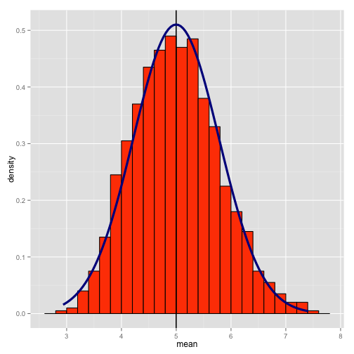

<h1>Statistical Inference Course Project</h1>

<h2><u> 1. Simulation Exercises </u></h2>
  
  <p>The exponential distribution can be simulated in R with rexp(n, lambda) where lambda is the rate parameter. The  mean of exponential distribution is 1/lambda and the standard deviation is also also 1/lambda. Set lambda = 0.2 for all of the simulations. In this simulation, you will investigate the distribution of averages of 40 exponential(0.2)s. Note that you will need to do a thousand or so simulated averages of 40 exponentials. </p>


```r
#setting up 
setwd("~/Desktop/statistical_inference_project")
lambda = 0.2
n = 40 # The number of samples per simulation
nosim = 1000 # The number of simulations
set.seed(25)
st <- replicate(nosim,rexp(n,lambda)); p <- NULL
for (i in 1:nosim){p[i] <- mean(st[,i])}
p <- as.data.frame(p); names(p)<-"mean"
```
<h3>1. Show where the distribution is centered at and compare it to the theoretical center of the distribution.</h3>

```r
## [1] "Calculated Center = 4.99851106119285"
## [1] "Theoretical Center = 5"
```
<p>calculated center is the mean of our sample means while the theoretical mean, with lambda = 0.2, is 5.</p>

<h3>2. Show how variable it is and compare it to the theoretical variance of the distribution.</h3>


```r
est.sd <- sd(p$mean); est.v <- est.sd ^ 2 / nosim; the.sd <- (1/lambda * 1/sqrt(n)); the.v <- the.sd ^ 2 / nosim
p2 <- matrix(c(est.sd,est.v,the.sd,the.v),nrow = 2,ncol = 2)
rownames(p2) <- c("St. Dev. of Sample Mean","Variance of Sample Mean"); colnames(p2) <- c("Estimated","Theoretical")
p2
```

```
##                         Estimated Theoretical
## St. Dev. of Sample Mean 0.7819075    0.790569
## Variance of Sample Mean 0.0006114    0.000625
```


```r
##                         Estimated Theoretical
## St. Dev. of Sample Mean 0.7819075    0.790569
## Variance of Sample Mean 0.0006114    0.000625
```
<p>This matrix identifies the standard deviations of our sample and the theoretical values. This indicates an estimated standard error of roughly 0.78.</p>

<h3>3. Show that the distribution is approximately normal.</h3>

```r
require(ggplot2)
```

```
## Loading required package: ggplot2
```

```r
g<-ggplot(p,aes(mean))
g<-g + geom_histogram(aes(y = ..density..),fill = "orangered",binwidth = .2,color = "black")
g<-g + geom_vline(xintercept = mean(p$mean),size = .75)
g<-g + stat_function(fun=dnorm, args=list(mean=mean(p$mean), sd=est.sd),color = "darkblue", size = 1.5)
g
```

 
<p>Using the estimated standard error, we can overlay what the normal distribution would appear as given this set of data and visually see that the histogram is a close approximation of a normal distribution</p>
<h3> 4.Evaluate the coverage of the confidence interval for 1/lambda: X¯±1.96Sn√.(This only needs to be done for the specific value of lambda). </h3>

```r
rng.min<-NULL; rng.max<-NULL
for(i in 1:nosim){
    rng.min[i]<-mean(st[,i])-1.96*sd(st[,i])/sqrt(n)
    rng.max[i]<-mean(st[,i])+1.96*sd(st[,i])/sqrt(n)
}
p$min<-rng.min; p$max<-rng.max; j <- 0
for (i in 1:nosim){
    if (5 > p$min[i] & 5 < p$max[i]){j <- j + 1}
}
coverage <- j/nosim
paste("Coverage =", coverage)
```

```
## [1] "Coverage = 0.932"
```

<p>The coverage is defined as how many times the theoretical mean is within the desired confidence interval, in this scenario 1.96σ, for each simulation. The confidence interval for each 40 sample simulation is calculated and the theoretical mean is compared to determine if it falls within the interval.</p>


 
